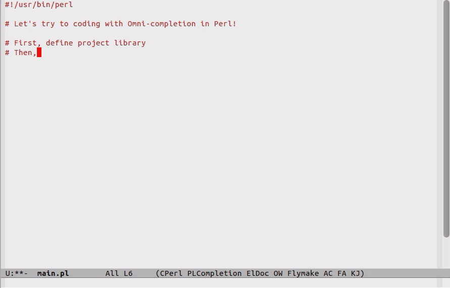

これは何？
==========

EmacsからPlSenseの機能を利用するためのEmacsの拡張です。

PlSenseは、ソースコード解析による型推論を用いて、Perl開発をサポートするツールです。  
詳しくは、https://github.com/aki2o/plsense/blob/master/README-ja.md

本拡張により、EmacsでのPerlコーディングにおいて、以下が可能になります。


特徴
====

### オムニ補完

Perlバッファで、以下の位置にポイントしている時、コンテキストに合わせた補完、いわゆるオムニ補完が利用できます。  

* 変数
* インスタンスメソッド
* クラスのイニシャライザ
* use/requireモジュール
* use/requireするモジュールに渡すLIST要素
* ハッシュキー


### 適切なヘルプ

表示された補完候補やポイントしている要素についてのヘルプを、ポップアップ表示したり別ウィンドウに表示したりできます。  
対象が変数やメソッドの場合は、PerlDocから該当箇所を抜き出します。  


### メソッドシグネチャ表示

eldoc.elを用いて、ポイントしているメソッドのシグネチャをミニバッファに表示します。  


### 定義元ジャンプ

ポイントしているメソッドの定義元へタグジャンプできます。  

### perl-completion.elとの連携

型推論によるオムニ補完が提供できない時は、
[perl-completion.el](https://github.com/imakado/perl-completion)を使って補完候補を表示します。  


デモ
====



長いバージョンはこちら -> <https://www.youtube.com/watch?v=qurNSQjOyK4>


Emacs以外に必要なもの
=====================

* Unixシェル (Windowsの場合は、Cygwinなど)
* Perl実行環境
* [PlSense](https://github.com/aki2o/plsense)


インストール
============

### package.elを使う場合

2013/09/10 melpaリポジトリからインストール可能  

### el-get.elを使う場合

2013/07/24 と言いつつ、まだ利用できません。  
2013/09/08 利用可能。ただし、masterブランチのみです。  

### auto-install.elを使う場合

```lisp
(auto-install-from-url "https://raw.github.com/aki2o/emacs-plsense/master/plsense.el")
```

※ 下記の依存拡張もそれぞれインストールする必要があります。  

### 手動の場合

plsense.elをダウンロードし、load-pathの通った場所に配置して下さい。

※ 下記の依存拡張もそれぞれインストールする必要があります。  

### 依存拡張

* [auto-complete.el](https://github.com/auto-complete/auto-complete)
* [log4e.el](https://github.com/aki2o/log4e)
* [yaxception.el](https://github.com/aki2o/yaxception)


設定
====

```lisp
(require 'plsense)

;; キーバインド
(setq plsense-popup-help-key "C-:")
(setq plsense-display-help-buffer-key "M-:")
(setq plsense-jump-to-definition-key "C->")

;; 必要に応じて適宜カスタマイズして下さい。以下のS式を評価することで項目についての情報が得られます。
;; (customize-group "plsense")

;; 推奨設定を行う
(plsense-config-default)
```


使い方
======

### バージョン確認

* `plsense-version` ... PlSenseのバージョン情報を表示する。

※ 上記を実行することにより、PlSenseのインストール確認が行えます。

### 起動/停止

* `plsense-server-start` ... PlSenseのサーバプロセスを起動します。
* `plsense-server-stop` ... PlSenseのサーバプロセスを停止します。

※ 事前にPlSenseの設定が完了している必要があります。  
※ 既にPlSenseサーバプロセスが存在する場合でも、Emacs上で`plsense-server-start`は実行する必要があります。  
※ 既に起動/停止している場合に、上記起動/停止コマンドを重複して実行してしまっても問題はありません。  
※ タイムアウトなどにより、成功していても`... is failed.`と表示される場合があります。  
※ その場合は以下のサーバ情報を参考に、サーバの状態を確認して下さい。  
※ 設定により、自動起動が可能。  

### サーバ情報

* `plsense-server-status` ... サーバの状態を表示する。
* `plsense-server-task` ... サーバが処理しているタスクを表示する。

#### サーバの種類

PlSenseサーバは、その用途毎に3つのプロセスに分かれています。

* Main Server ... 補完/ヘルプの提供。
* Work Server ... ライブラリの検索やソース解析などのタスク管理。
* Resolve Server ... 個々のモジュール/ファイルの解析結果の集計。

#### サーバの状態

* Running ... 起動済み。クライアントの要求待ち。
* Busy ... 起動しているが、何らかの処理を行っていて応答できない状態。
* Not Running ... 起動していない。

#### サーバのタスク

* build _モジュール名/ファイル名_ ... 該当モジュール/ファイルのソース解析中。
* find _文字列_ ... インストール済みやプロジェクト固有のライブラリモジュール検索中。

### 補完/ヘルプ表示の有効/無効

上記のPlSenseサーバの起動/停止が、有効/無効のスイッチも兼ねています。  
`plsense-server-start`実行後であれば、バッファを開くと同時に有効になります。  
しかし、バッファのソース解析が完了するまでは、補完/ヘルプ表示はできません。  
解析が完了し、補完/ヘルプ表示が可能になると、`... is ready.`と表示されます。

* `plsense-buffer-is-ready` ... カレントバッファの解析状況を表示する。
* `plsense-reopen-current-buffer` ... カレントバッファの解析を再度開始する。

※ `plsense-server-start`実行前に開いていたバッファでは自動で有効になりません。  
※ その場合は、`plsense-reopen-current-buffer`を実行して下さい。  
※ バッファに紐付けられたファイルが存在しないと有効になりません。  
※ find-file時は、一旦ファイルを保存して下さい。  
※ `plsense-enable-modes`のモード以外のバッファでは有効にはなりません。  

#### バッファ解析状況

* Yes ... 解析済み。
* Now Loading ... 解析中。
* No ... 未解析。
* Not Found ... バッファに紐付けられたファイルをPlSenseサーバが判別できない。

※ Noが表示される場合、有効になっていないかも知れません。`plsense-reopen-current-buffer`を実行してみて下さい。  
※ Not Foundが表示される場合、文法エラーをチェックして下さい。文法エラー時には解析できません。  
※ その他で、Not Foundが表示される場合、サーバとの同期を参照して下さい。  
※ その他、タイミングによっては、NoやNot Foundが表示される場合があります。  

### サーバとの同期

適切な補完/ヘルプ表示のために、編集中のコンテキストをPlSenseサーバに通知し、
Emacs上のコンテキストとPlSenseサーバに設定されたコンテキストを同期する必要があります。  
通常は本拡張が自動で行っていますが、PlSenseサーバプロセスとの通信に失敗するなどの理由により、
同期に失敗し、それが自動では回復できない状態に陥る場合があります。  
もし、補完/ヘルプ表示ができなくなり、エラーメッセージが頻発するようなことがあれば、以下を実行してみて下さい。

* `plsense-update-location` ... 現在のコンテキストをPlSenseサーバに通知し同期する。

※ 上記でも改善しない場合は、PlSenseサーバを再起動して下さい。

### サーバのリフレッシュ

バッファを編集すると、編集内容がPlSenseサーバに通知され、その解析結果が蓄積されていきます。  
そのため、PlSenseサーバを長時間起動し続けていると以下の弊害が発生する場合があります。

* PlSenseサーバプロセスの消費メモリの増大。
* 同じ箇所を度々変更した場合、解析結果が期待通りにならない。

その場合には、以下を実行して下さい。

* `plsense-server-refresh` ... PlSenseサーバを初期化し、最新のソースを解析する。

※ PlSenseサーバの再起動でも同様の効果が得られますが、実行中のタスクがあった場合、その結果が消失してしまいます。


留意/制限事項
=============

### 文法エラー

PlSenseは、文法エラーがあるファイルは解析できません。  

* 文法エラーなファイルを開いても有効にならない
* 文法エラーな状態でファイルを保存しても編集内容が補完/ヘルプ表示に反映されない

といった事が起こります。

※ 文法エラーのチェックは、シェル上から`perl -c ファイルパス`により実施できます。  

### プロジェクト形式の開発

そのプロジェクトだけのための固有ライブラリを用意するような、
ツリー構造で複数ファイルを開発する場合には、
[プロジェクト情報ファイル](https://github.com/aki2o/plsense/wiki/Library-@ja#wiki-projconf)を作成する必要があります。

### 型推論

PlSenseは、ソースコードの解析により、型推論を行いますが、
Perlには無数の記述方法があり、その全てを解析できる訳ではありません。  
扱うコードによっては、型推論に失敗し補完/ヘルプ表示の提供ができない場合もあります。  
詳しくは、[型推論の仕様](https://github.com/aki2o/plsense/wiki/TypeInference-@ja)を参照して下さい。  

※ その場合、perl-completion.elがインストールされていれば、perl-completion.elを使って補完候補を表示します。  

### 補完/ヘルプ表示内容の最適化

解析は、カレントバッファから順に再帰的に実施されます。  
カレントバッファA ⇒ AがuseしているモジュールB ⇒ BがuseしているモジュールC ...  
という感じです。

補完/ヘルプ表示は、カレントバッファの解析が完了した時点から可能になりますが、
上記のようにバックグラウンドでは解析処理が行われていたりします。  
つまり、カレントバッファAだけではなく、モジュールCまで解析しないと特定できないようなコンテキストの場合は、
補完/ヘルプ表示が最適化されるまでにタイムラグが発生します。  
これは、バッファを編集、更新した際も同じです。

解析結果は保存され、そのモジュール/ファイルに変更があるまで再利用されますので、
一旦全ての解析が完了すれば、多数のモジュールをuseしていても最適化に時間はかかりませんが、
初回は、最適化までにある程度の時間が必要です。  
どの程度の時間を要するかは、PlSenseサーバの設定、お使いのマシン性能により変化するかと思います。  
詳しくは、[こちら](https://github.com/aki2o/plsense/wiki/Resource-@ja)を参照して下さい。

また、多数の解析処理が実行されている間は、Emacs自体の挙動も重くなるかと思います。  
実行されている解析処理の確認は、`plsense-server-task`を実行することで行えます。

### バッファの編集内容の反映

補完/ヘルプ表示時にバッファの最新の内容を解析して結果を表示するのが1番良いのですが、
コストが高いので、別のタイミングで解析を実施することでパフォーマンスが低下しないようにしています。  
上記設定の`plsense-config-default`により、以下のタイミングで解析が実施されます。

* save-buffer
* newline
* newline-and-indent
* yank
* yas/commit-snippet

※ 解析が実施されないと、バッファの編集内容は補完/ヘルプ表示に反映されません。  
※ 解析には簡易的な解析と完全な解析があり、上記の場合、save-buffer以外は簡易的な解析です。  

#### バッファ編集中の解析について

* 簡易的な解析は高速ですが、反映されない要素があります。
    * useなどでモジュールからインポートしたメソッドや変数
* 完全な解析は、`plsense-update-current-buffer`を実行することで可能です。
* 簡易的な解析は、`plsense--add-pointed-source`を実行することで可能です。
* 簡易的な解析のタイミングは、`plsense-server-sync-trigger-ize`を使うことで追加できます。
* 解析タイミングを追加/変更する場合、これらのヘルプや`plsense-config-default`の定義を参照して下さい。

### ヘルプの表示内容

変数やメソッドの場合は、PerlDocから該当箇所を抜き出しますが、適切な箇所を抜き出せない場合もあります。  
その場合には、該当モジュールのヘルプを表示して下さい。


動作確認
========

* Emacs ... GNU Emacs 23.3.1 (i386-mingw-nt5.1.2600) of 2011-08-15 on GNUPACK
* auto-complete.el ... 1.4.0
* log4e.el ... 0.2.0
* yaxception.el ... 0.1


**Enjoy!!!**

