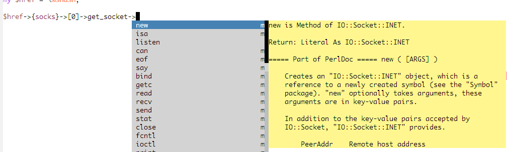
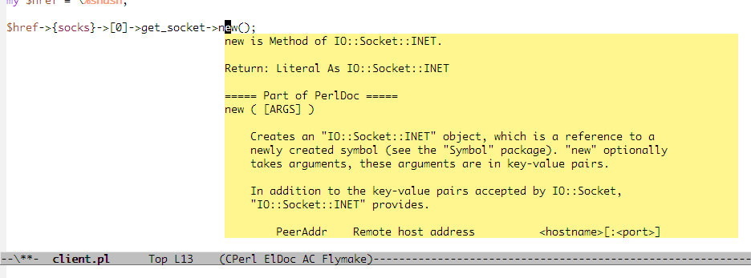
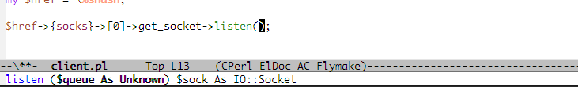

[Japanese](https://github.com/aki2o/emacs-plsense/blob/master/README-ja.md)

What's this?
============

This is a extension of Emacs that provide interface for PlSense.

PlSense is a development tool for Perl.  
PlSense provides completion/help optimized for context by the type inference.  
For detail, see https://github.com/aki2o/plsense/blob/master/README.md

Using this extension, you can do coding Perl on Emacs like the following.


Feature
=======

### Provide a optimized completion by auto-complete.el

When you are on Perl buffer, provide completion optimized for context using auto-complete.el.  
The candidates are optimized by the type inference.  
Provide a optimized completion on the following position of the buffer.  

* Variable
* Method
* Module
* Initializer of Class
* LIST of Use/Require statement
* Key of Hash



### Provide a optimized help by doing popup or displaying buffer



### Show signature of method by eldoc.el



### Jump to definition of method

### Use perl-completion.el as supplements

use [perl-completion.el](https://github.com/imakado/perl-completion)
for compeltion if fail the type inference.  


Demo
====

http://www.youtube.com/watch?v=Q8XDhxqmaXs


Requirement
===========

* Unix Shell ( If Windows, e.g. Cygwin )
* Perl
* [PlSense](https://github.com/aki2o/plsense)


Install
=======

### If use package.el

2013/09/10 It's available by using melpa.  

### If use el-get.el

2013/07/26 Not yet available.  
2013/09/08 It's available. But, master branch only.  

### If use auto-install.el

```lisp
(auto-install-from-url "https://raw.github.com/aki2o/emacs-plsense/master/plsense.el")
```

\* Installing each the following dependency is required in this case.

### Manually

Download plsense.el and put on your load-path.

\* Installing each the following dependency is required in this case.

### Dependency

* [auto-complete.el](https://github.com/auto-complete/auto-complete)
* [log4e.el](https://github.com/aki2o/log4e)
* [yaxception.el](https://github.com/aki2o/yaxception)


Configuration
=============

```lisp
(require 'plsense)

;; Key binding
(setq plsense-popup-help-key "C-:")
(setq plsense-display-help-buffer-key "M-:")
(setq plsense-jump-to-definition-key "C->")

;; Make config suit for you. About the config item, eval the following sexp.
;; (customize-group "plsense")

;; Do setting recommemded configuration
(plsense-config-default)
```


Usage
=====

### Show version

* `plsense-version` ... show version of PlSense.

\* Double as a verification of install.

### Start/Stop server

* `plsense-server-start` ... start process of PlSense server.
* `plsense-server-stop` ... stop process of PlSense server.

\* You must finish configuration of PlSense on ahead.  
\* You must do `plsense-server-start` on Emacs regardless of whether PlSense server process exist.  
\* Executing the above command redundantly is OK.  
\* Maybe show `... is failed` despite the success of the above command along of timeout.  
\* In the case, verify status of PlSense server by seeing 'Information of server' section below.  
\* You can do `plsense-server-start` automatically by configuration.  

### Information of server

* `plsense-server-status` ... show status of PlSense server.
* `plsense-server-task` ... show the running tasks on PlSense server.

#### Kind of server

* Main Server ... provide completion/help.
* Work Server ... manage task for searching library and analyzing File/Module.
* Resolve Server ... gather result of analyzing File/Module.

#### Status of server

* Running ... can accept client.
* Busy ... can not accept client.
* Not Running ... not yet started.

#### Task of server

* build _File/Module_ ... Analyzing the File/Module.
* find _String_ ... Searching library about the String.

### Active/Inactive provision of completion/help

The above command in 'Start/Stop of server' section, double as a switching active/inactive.  
If you have executed `plsense-server-start`, provision of completion/help is active when open buffer.  
But, not start provision of completion/help until finish analyzing the buffer.  
When start provision of completion/help, show `... is ready.`.

* `plsense-buffer-is-ready` ... show status about analyzing current buffer.
* `plsense-reopen-current-buffer` ... restart analyzing current buffer.

\* Not activate automatically on the buffer that opened before executing `plsense-server-start`.  
\* In the case, execute `plsense-reopen-current-buffer` for activate.  
\* Not activate automatically if the buffer file is not exists.  
\* When execute `find-file`, save the buffer.  
\* Not activate on the buffer of the mode not included in `plsense-enable-modes`.  

#### Status about analyzing buffer

* Yes ... finished.
* Now Loading ... do analyzing now.
* No ... not start analyzing.
* Not Found ... PlSense server can't identify the buffer file.

\* If status is 'No', the buffer maybe not activate. execute `plsense-reopen-current-buffer`.  
\* If status is 'Not Found', check syntax error. PlSense can not analyze when syntax error.  
\* If status is 'Not Found' other than above case, see 'Sync server' section below.  
\* Otherwise, status maybe 'No' or 'Not Found' despite the finish of analyzing.  

### Sync server

For a optimized completion/help, it's required that synchronization of context between Emacs and PlSense server.  
Normally, it's finished by this extension automatically.  
But, it maybe happen that synchronization is failed by some reason and it isn't recovered automatically.  
If not show completion/help and show error message continuously, execute the following command.

* `plsense-update-location` ... inform Plsense server of current context forcibly.

\* If not recovered by the above command, restart PlSense server.  

### Refresh server

The result of analyzing is gathered on PlSense server with edit buffer on Emacs.  
Then, the following maybe happen by running PlSense server over a long time.  

* Increase of quantity of expending memory by PlSense server.
* If you edit same point in many times, the result of completion/help differ from expectation.

In the case, execute the following command.

* `plsense-server-refresh` ... initialize PlSense server and start analyzing the newest source code.

\* Restart PlSense server is also OK. But if running task exists, the result is lost.


Restriction
===========

### Syntax error

PlSense can not analyze the file that has syntax error.  
It means the following.

* The buffer is not active when open the file that has syntax error.
* The result of completion/help is not updated when save the file that has syntax error.

\* For checking syntax error, execute `perl -c /path/to/file` on shell.

### Development in project tree

If you develop in project tree which has particular library for the project,
need to make [ProjectInfoFile](https://github.com/aki2o/plsense/wiki/Library#wiki-projconf).  

### Type inference

PlSense do the type inference by analyzing a source code of Perl.  
But, it maybe happen the type inference is failed because Perl has a lot of grammar.  
In the above case, a optimized completion/help is not provided.  
For detail, see https://github.com/aki2o/plsense/wiki/TypeInference.  

\* If perl-completion.el is available, Instead provides a completion using perl-completion.el.  

### Optimize completion/help

Analyzing is started from current buffer recursively in sequence.  
It like the following.  

CurrentBuffer A => A's UseModule B => B's UseModule C ...

Provision of completion/help is started when finished analyze current buffer.  
But, analyzing continue in the background like the above.  
It means that a few minutes is required for the result of completion/help is optimized.  
It apply when you open/edit/save buffer.

The result of analyzing is saved and used until the file is changed.  
So, If finish the all analyzing, provision of a optimized completion/help is started soon.  

About the time required for the all analyzing is finished,
see https://github.com/aki2o/plsense/wiki/Resource.  

I guess that the Emacs action become sluggish while a many tasks is running.  
If you notice it, you can show the task by `plsense-server-task`.

### Reflect the result of editing buffer

I think the best way is that analyzing is done for latest content of buffer when user require completion/help.  
But, the way is high cost.  
So, do analyzing at the other timing for high-performance.  
If you use `plsense-config-default`, the timing is when the following command is executed.

* save-buffer
* newline
* newline-and-indent
* yank
* yas/commit-snippet

\* There are two type of Analyzing, simplified/complete.  
\* In the above case, Analyzing is simplified at the timing other than save-buffer.  

#### About analyzing in editing buffer

* A simplified analyzing is low cost. But the following item is not reflect.
    * imported method/variable by use statement
* You can do a complete analyzing by executing `plsense-update-current-buffer`.
* You can do a simplified analyzing by executing `plsense--add-pointed-source`.
* You can add the timing of a simplified analyzing by using `plsense-server-sync-trigger-ize`.
* If you want to change the analyzing timing, see help of them and definition of `plsense-config-default`.

### Content of help

Picking up the Variable/Method help from PerlDoc maybe failed.  
In the case, show the help of module that the Variable/Method belong to.


Tested On
=========

* Emacs ... GNU Emacs 23.3.1 (i386-mingw-nt5.1.2600) of 2011-08-15 on GNUPACK
* auto-complete.el ... 1.4.0
* log4e.el ... 0.1
* yaxception.el ... 0.1


**Enjoy!!!**

